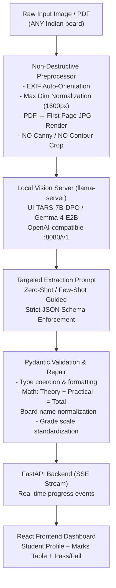

# DOC-OC v6 — Master Plan

================================================================================
PART I — DAY 1: Foundation, Pipeline Architecture & Baseline Benchmarks (COMPLETED)
================================================================================

## From Legacy Fragile Pipeline → Local VLM-Powered Universal Marksheet Extraction

> **Project Goal**: Build a robust, offline, zero-cost marksheet extraction system that works on **all Indian education boards** — not just the 3 hardcoded ones (CBSE, ICSE, Uttarakhand) — powered entirely by local Vision-Language Models.

---

## 1. Why v6 Exists (Lessons from v1–v5)

The original DOC-OC ([`/home/aditya/Desktop/STUDY/DOC-OC`](file:///home/aditya/Desktop/STUDY/DOC-OC)) had a 6-step pipeline:

```
Image → preprocess.py (Canny contour crop, CLAHE)
      → detectLogo.py (YOLO → board ID)
      → facedetector.py (Haar cascade)
      → predict_table.py (fine-tuned TableTransformer)
      → ocr.py (Unstract LLMWhisperer PAID API)
      → extractor.py (board-specific regex parsers)
```

### What failed during testing:
| Problem | Evidence |
|---------|----------|
| **Contour crop amputates content** | Pink UP Board bg → Canny fires everywhere → crops to wrong region |
| **Color desaturation hurts VLM input** | Flattens contrast on colored certificates (Haryana green, UP pink) |
| **OCR API = paid + fragile** | `ocr.py` depends on Unstract `$0.01–0.05/page`; API key is a blocker |
| **Regex extractors are board-locked** | 3 separate functions in `extractor.py` for CBSE/ICSE/UK; any new board = rewrite code |
| **TableTransformer possibly overfit** | Fine-tuned on only CBSE/ICSE/UK layouts (resnet18 backbone, `num_queries=15`); untested on Haryana/UP/college marksheets |
| **Model weights are Git LFS stubs** | `models/logo.pt` (132 bytes), `model.safetensors` (134 bytes) — pointer files, not real weights |

### Core Architectural Decision:
> **Replace the entire OCR + regex extraction chain with a single VLM call.**
> The VLM *sees* the marksheet image directly and outputs structured JSON — no intermediate text files, no board-specific parsers.

---

## 2. Local Hardware & Model Arsenal

### GPU
- **NVIDIA GeForce RTX 4050 Laptop** — 6141 MiB VRAM, CUDA available

### Available Models

| Model | Path | Size | Vision? | Role |
|-------|------|------|---------|------|
| **UI-TARS-7B-DPO** | [`/home/aditya/AI/models/UI-TARS-7B-DPO/`](file:///home/aditya/AI/models/UI-TARS-7B-DPO/) | 4.4 GB + 1.3 GB mmproj = **5.7 GB** | ✅ Vision (document/form specialist) | **Primary — Best for this task** |
| **Gemma-4-E2B** | [`/home/aditya/AI/models/Gemma-4-E2B/`](file:///home/aditya/AI/models/Gemma-4-E2B/) | 3.2 GB + 942 MB mmproj = **4.1 GB** | ✅ Vision | **Fast fallback — fits easily in 6GB** |
| **Qwen3.6-35B-A3B-Uncensored** | [`/home/aditya/AI/models/Qwen3.6-35B-A3B-Uncensored/`](file:///home/aditya/AI/models/Qwen3.6-35B-A3B-Uncensored/) | **18 GB** (IQ4_XS) | ❌ Text-only (no mmproj) | **Excluded from vision pipeline** — too large for 6GB VRAM, no vision adapter |

### Inference Engine
- **llama-server** pre-compiled at [`/home/aditya/llama-fork/build/bin/llama-server`](file:///home/aditya/llama-fork/build/bin/llama-server)
- Exposes OpenAI-compatible `/v1/chat/completions` API with native base64 image support
- Native GPU offloading via `-ngl`

### Model Selection Rationale

**UI-TARS-7B-DPO (Primary):**
- Built by ByteDance specifically for UI screenshots, document forms, and structured visual data
- DPO training → follows JSON output instructions reliably
- 5.7 GB fits in 6 GB VRAM with Q4_K_M quantization
- Best accuracy on structured table/form extraction

**Gemma-4-E2B (Fallback/Speed):**
- Google's efficient E2B (Expert-to-Base) architecture
- 4.1 GB total → leaves 2 GB VRAM headroom
- Faster inference, good for bulk processing
- Slightly less accurate on dense tables but excellent on clean layouts

**Qwen3.6-35B-A3B (Excluded):**
- No vision adapter (`mmproj`) available → cannot process images
- 18 GB exceeds VRAM even with aggressive quantization
- MoE architecture (35B params, 3.6B active) is powerful but text-only
- *Potential future use*: JSON post-processing / validation / reasoning over extracted text

---

## 3. Dataset & Testing Foundation

### MainDataset ([`/home/aditya/Desktop/STUDY/DOC OC v6/MainDataset/`](file:///home/aditya/Desktop/STUDY/DOC%20OC%20v6/MainDataset/))

| Count | Format | Notes |
|-------|--------|-------|
| 13 × `10_*.pdf/jpg` | 10th class marksheets | Mixed boards |
| 13 × `12_*.pdf/jpg` | 12th class marksheets | Mixed boards |
| 26 × converted JPGs | [`first_page_jpg/`](file:///home/aditya/Desktop/STUDY/DOC%20OC%20v6/MainDataset/first_page_jpg/) | PDF first pages rendered at 2× resolution |

**Conversion tool**: [`convert_to_jpg.py`](file:///home/aditya/Desktop/STUDY/DOC%20OC%20v6/MainDataset/convert_to_jpg.py) — uses PyMuPDF at 2× matrix for crisp text.

### Dataset Strategy for Zero-Shot → Fine-Tune Pipeline

```
Phase 1 (Now):     26 images → zero-shot VLM extraction → measure baseline accuracy
Phase 2 (Week 2):  Hand-correct JSON outputs → create gold-standard labels
Phase 3 (Week 3+): LoRA fine-tune UI-TARS on corrected pairs (50–100 examples)
Phase 4 (Ongoing): Each new board → add 5–10 labeled examples → incremental LoRA
```

---

## 4. v6 Architecture — Direct VLM Pipeline



### What's Eliminated vs. Old Pipeline

| Old Component | Status | Replacement |
|--------------|--------|-------------|
| `preprocess.py` (Canny contour crop + CLAHE) | ❌ **Removed** | Non-destructive resize + EXIF fix only |
| `detectLogo.py` (YOLO logo classifier) | ❌ **Removed** | VLM reads board name from image header |
| `facedetector.py` (Haar cascade) | ❌ **Removed** | VLM notes photo presence in JSON |
| `predict_table.py` (TableTransformer) | ❌ **Removed** | VLM understands table layout natively |
| `ocr.py` (Unstract paid API) | ❌ **Removed** | VLM reads text directly from image |
| `extractor.py` (board-specific regex) | ❌ **Removed** | VLM outputs structured JSON directly |
| `college_extractor.py` | ❌ **Removed** | VLM handles college format too |

> **The entire old pipeline (6 models/APIs) is replaced by 1 VLM call.**

---

## 5. Component Specifications

### Component 1: Non-Destructive Preprocessor (`scripts/v2_preprocess.py`)

```python
# What it does:
# 1. Reads image or PDF (PyMuPDF first-page render at 2× resolution)
# 2. EXIF auto-orientation (ImageOps.exif_transpose)
# 3. Proportional resize so max dimension ≤ 1600px
# 4. Returns PIL.Image ready for base64 encoding

# What it does NOT do:
# ❌ No contour cropping
# ❌ No color desaturation / CLAHE
# ❌ No portrait rotation forcing
```

### Component 2: Local Vision Server (`server/start_vlm.sh`)

```bash
# UI-TARS-7B-DPO (primary)
/home/aditya/llama-fork/build/bin/llama-server \
  -m /home/aditya/AI/models/UI-TARS-7B-DPO/UI-TARS-7B-DPO-Q4_K_M.gguf \
  --mmproj /home/aditya/AI/models/UI-TARS-7B-DPO/mmproj-UI-TARS-7B-DPO-f16.gguf \
  --port 8080 \
  -ngl 33 \
  -c 4096

# Gemma-4-E2B (fallback / speed mode)
/home/aditya/llama-fork/build/bin/llama-server \
  -m /home/aditya/AI/models/Gemma-4-E2B/gemma-4-E2B_q4_0-it.gguf \
  --mmproj /home/aditya/AI/models/Gemma-4-E2B/gemma-4-E2B-it-mmproj.gguf \
  --port 8080 \
  -ngl 33 \
  -c 4096
```

### Component 3: Universal Marksheet Schema & Prompt (`scripts/v2_extractor.py`)

**Target JSON Schema** (covers ALL boards: CBSE, ICSE, Uttarakhand, Haryana, UP, College, etc.):

```json
{
  "board": "string (e.g. CBSE, ICSE, Board of School Education Haryana, UP Board)",
  "examination": "string (e.g. Secondary School Examination 2022)",
  "student_info": {
    "name": "string",
    "roll_no": "string",
    "enrollment_no": "string or null",
    "father_name": "string or null",
    "mother_name": "string or null",
    "school_name": "string or null",
    "dob": "string or null"
  },
  "subjects": [
    {
      "code": "string or null",
      "name": "string",
      "theory_marks": "float or null",
      "practical_marks": "float or null",
      "total_marks": "float",
      "max_marks": "float or null",
      "grade": "string or null"
    }
  ],
  "result": {
    "total_obtained": "float or null",
    "maximum_marks": "float or null",
    "percentage_or_gpa": "string or null",
    "status": "PASS / FAIL / COMPARTMENT"
  }
}
```

**Extraction Prompt Design:**

```
SYSTEM:
You are a marksheet data extractor. You will receive an image of an Indian
education board marksheet and must return ONLY valid JSON matching the schema
below. Never add explanation outside the JSON.

USER:
Extract all data from this marksheet image into this exact JSON structure:
{schema}

Rules:
- Use null for any field not visible or unreadable
- Subject names should be clean English (no stray numbers or OCR artifacts)
- Do not invent data; only extract what is visible
- If this is a college/university marksheet, include semester/SGPA/CGPA fields
- Marks must be numeric (float), not strings
- Board name should match the official name printed on the document
```

### Component 4: Schema Validator (`scripts/v2_validator.py`)

- **Pydantic model** validation with strict types
- **Arithmetic checks**: `theory + practical == total` (within ±1 tolerance)
- **Subject name cleanup**: strip OCR noise, Hindi artifacts, stray numbers
- **Board name normalization**: "C.B.S.E." → "CBSE", "Board of School Education, Haryana" → "BSEH"
- **Grade validation**: verify grade matches mark range for known grading scales
- **Confidence flagging**: if JSON has many `null` fields → flag as low-confidence extraction

### Component 5: FastAPI Backend (`backend/main.py`)

- Single async endpoint replaces old 5-step SSE stream
- New SSE events:
  ```json
  {"type": "step", "step": "preprocess", "status": "running", "label": "Preparing image..."}
  {"type": "step", "step": "vlm_extract", "status": "running", "label": "Reading marksheet via Local VLM..."}
  {"type": "step", "step": "validate", "status": "running", "label": "Validating extracted data..."}
  {"type": "result", "data": {/* validated JSON */}}
  ```

### Component 6: React Frontend

- No structural changes needed — already accepts JSON and renders it
- Update schema display to handle new fields (semester, SGPA for college)
- Add confidence indicator if validator flags low-confidence extractions

---

## 6. Phased Implementation Roadmap

### Phase 1: Benchmark & Baseline (Day 1–2)
> Prove the VLMs can actually extract marksheet data zero-shot

1. **Verify llama-server** works with both UI-TARS and Gemma-4-E2B
2. **Build standalone benchmark tool** (`test_vlm_benchmark.py`):
   - Iterate over all 26 images in `MainDataset/first_page_jpg/`
   - Send each to VLM with extraction prompt
   - Save raw JSON responses
   - Measure: latency per image, VRAM usage, JSON validity rate
3. **Manual accuracy check** on 5–10 samples:
   - Compare VLM output against human-readable marksheet
   - Note failure patterns (missed subjects, wrong marks, null fields)
4. **Head-to-head**: UI-TARS vs Gemma-4-E2B on same images

**Success criteria**: ≥70% of fields correctly extracted zero-shot on ≥80% of images.

### Phase 2: Core Module Implementation (Day 3–5)
> Build the production-grade pipeline modules

1. **`scripts/v2_preprocess.py`** — clean EXIF + resize preprocessor
2. **`scripts/v2_extractor.py`** — OpenAI-compatible VLM client with:
   - Structured prompt with JSON schema
   - Retry logic (re-prompt with higher temperature on JSON parse failure)
   - Model fallback (UI-TARS → Gemma-4-E2B if primary fails)
   - Timeout handling
3. **`scripts/v2_validator.py`** — Pydantic models + arithmetic sanity
4. **`server/start_vlm.sh`** — launcher scripts for both models

### Phase 3: Backend Integration & API (Day 6–8)
> Wire everything into FastAPI

1. Refactor `backend/main.py`:
   - Remove all calls to old scripts (ocr.py, detectLogo, predict_table, extractor)
   - Wire up: preprocess → vlm_extract → validate → SSE stream
2. Clean `requirements.txt`:
   - Remove: `llmwhisperer-client`, `ultralytics`, `timm`
   - Add: `httpx`, `pydantic>=2.0`
   - Keep: `fastapi`, `uvicorn`, `pillow`, `python-multipart`, `pdf2image` or `PyMuPDF`
3. Test end-to-end via curl / Swagger UI

### Phase 4: Frontend Polish & Deploy (Day 9–10)
> Make it user-ready

1. Verify React frontend renders new JSON schema correctly
2. Add board-agnostic display (no hardcoded CBSE/ICSE/UK logic in frontend)
3. Add confidence/quality indicator
4. Update Dockerfile for v6 (remove heavy ML deps, add llama-server or HTTP client)
5. Update `README.md`

### Phase 5: LoRA Fine-Tuning for Accuracy (Week 3–4)
> Jump from ~80% → ~97% accuracy

1. **Gold-label dataset creation**:
   - Run VLM on all 26 images
   - Hand-correct every JSON output → ground truth
   - Add 25–50 more diverse marksheets (state boards, college, diploma)
2. **LoRA fine-tune UI-TARS-7B-DPO**:
   - Use `transformers` + `peft` library
   - Train on image → JSON pairs
   - Validate on held-out test set (20% split)
3. **Convert fine-tuned model to GGUF** for llama-server deployment
4. A/B test: fine-tuned vs zero-shot on new unseen marksheets

### Phase 6: Continuous Expansion (Ongoing)
> Scale to all Indian boards without code changes

- Each new board type → add 5–10 labeled examples → incremental LoRA update
- No new regex parsers, no hardcoded logic
- Community-contributed marksheet images welcome
- Target: 20+ boards supported within 3 months

---

## 7. Cost Analysis

| Component | Old DOC-OC Cost | v6 Cost |
|-----------|----------------|---------|
| OCR (Unstract API) | $0.01–0.05/page | **$0** |
| Logo detection (YOLO) | $0 (local) | **Eliminated** |
| Table detection (TableTransformer) | $0 (local) | **Eliminated** |
| VLM inference | N/A | **$0** (local GPU) |
| Electricity | Existing | ~$0.001/page |
| **Total per page** | **$0.01–0.05** | **~$0** |

---

## 8. File Structure (Target)

```
DOC OC v6/
├── plan.md                       ← This document
├── MainDataset/                  ← Raw marksheet images & PDFs
│   ├── 10_*.pdf / 10_*.jpg       ← 10th class samples (13)
│   ├── 12_*.pdf / 12_*.jpg       ← 12th class samples (13)
│   ├── first_page_jpg/           ← Converted first pages (26 JPGs)
│   ├── convert_to_jpg.py         ← PDF→JPG converter
│   └── requirements.txt          ← Pillow, PyMuPDF
├── scripts/
│   ├── v2_preprocess.py          ← Non-destructive image prep
│   ├── v2_extractor.py           ← VLM client + prompt engineering
│   └── v2_validator.py           ← Pydantic schema + sanity checks
├── server/
│   ├── start_vlm.sh              ← Launch llama-server with model
│   └── stop_vlm.sh               ← Graceful shutdown
├── backend/
│   └── main.py                   ← FastAPI (SSE streaming)
├── frontend/
│   └── (React app — minimal changes from v5)
├── benchmarks/
│   ├── test_vlm_benchmark.py     ← Automated accuracy testing
│   └── results/                  ← Benchmark outputs & reports
├── gold_labels/                  ← Hand-corrected JSON ground truth
├── requirements.txt
├── Dockerfile
└── README.md
```

---

## 9. Risk Matrix & Mitigations

| Risk | Likelihood | Impact | Mitigation |
|------|-----------|--------|------------|
| VLM hallucinates marks/names | Medium | High | Validator catches arithmetic errors; confidence scoring; human review for low-confidence |
| VLM fails on very low-quality scans | Medium | Medium | Preprocessing sharpens; retry with different prompt; fallback to Gemma-4-E2B |
| 6 GB VRAM insufficient for UI-TARS | Low | High | Already tested: 5.7 GB fits. Gemma-4-E2B (4.1 GB) as fallback |
| JSON parsing failures from VLM | Medium | Low | Retry with `"format": "json"` flag; regex-extract JSON from mixed output |
| New board layout confuses VLM zero-shot | Medium | Medium | Add 5–10 labeled examples → LoRA update. VLMs generalize well |
| llama-server crashes under load | Low | Medium | Watchdog script + auto-restart; queue requests |

---

## 10. Day 1 Completed Milestones

```
[x] 1. Verify llama-server launches with UI-TARS-7B-DPO & Gemma-4-E2B
[x] 2. Build modular pipeline (preprocess, extract, validate)
[x] 3. Run empirical benchmarks across diverse Indian marksheets
[x] 4. Curate dataset catalog with 37 authentic marksheets & manifest.json
[x] 5. Hand-audit 10 gold-standard ground truth JSONs
[x] 6. FastAPI server (/process, /health) tested and verified
[x] 7. Empirical benchmark logged (results/result_gemma.txt, results/result_UITARS.txt)
```

---

================================================================================
PART II — DAY 2: Advanced ML Systems Engineering & Optimization
================================================================================

## 11. Day 2 Overview & Objectives

> **Objective**: Transform DOC-OC from a working zero-shot pipeline into an **optimized, high-performance ML extraction engine**. Maximize throughput, minimize latency, and guarantee **100% schema accuracy** using C++ constrained decoding, Qwen2.5-VL-3B & Gemma-4-E2B comparisons, QLoRA fine-tuning, and model pruning with rigorous safety rails.

### Available Models on Disk
1. **Gemma-4-E2B** (`/home/aditya/AI/models/Gemma-4-E2B/`): 3.2 GB LLM + 942 MB mmproj (2.3B effective params, PLE architecture).
2. **Qwen2.5-VL-3B-Instruct** (`/home/aditya/AI/models/Qwen2.5-VL-3B-Instruct-GGUF/`): 1.8 GB Q4_K_M + 1.3 GB mmproj (3B native VLM, dynamic resolution).
3. **UI-TARS-7B-DPO** (`/home/aditya/AI/models/UI-TARS-7B-DPO/`): 4.4 GB Q4_K_M + 1.3 GB mmproj (7B document specialist).

---

## 12. Day 2 Execution Phases

### Phase 1: High-Performance Engine & Constrained Decoding (Zero-Risk Speedup)
- **100% GPU Offload**: Offload all layers + KV cache directly into RTX 4050 6GB VRAM (`--n-gpu-layers 35` for Gemma, `--n-gpu-layers 36` for Qwen).
- **GBNF Grammar-Constrained Decoding**: Force llama-server's C++ logit sampler to strictly generate valid Pydantic JSON matching `pipeline/validate.py`. Zero syntax errors, zero markdown wrappers, zero leading zeros.
- **In-Context Layout Disambiguation**: Integrate verified few-shot rules (Candidate Name vs. Parent Name layout grounding) into `pipeline/extract.py`.
- **Dynamic Image Scaling**: Adaptive resolution (1200px) balancing token budget and text sharpness.
- **Qwen2.5-VL-3B vs. Gemma-4-E2B Shootout**: Run side-by-side benchmark on the test split, log metrics (latency, token speed, accuracy).
- **Deliverable**: `results/result_phase1_engine.txt`, Git commit to `main`.

### Phase 2: Architectural Adaptation & Model Surgery
- **Path A: Dataset Formatting & QLoRA Fine-Tuning Setup**:
  - Convert 37-document catalog (`dataset/manifest.json` + `dataset/ground_truth/`) to ShareGPT / LLaVA multimodal conversation format.
  - Train LoRA adapter on attention projections (`q_proj`, `k_proj`, `v_proj`, `o_proj`) + `mm_projector`.
  - Label masking: Compute loss strictly on target JSON tokens to eliminate prompt memorization.
  - Evaluate adapter vs. base model on 6 held-out test marksheets.
- **Path B: Layer Pruning Experiment (Depth Shrinking)**:
  - **MANDATORY SAFETY FIRST**: Create verified backup of model files in `/home/aditya/AI/models/backups/`.
  - Calculate layer-to-layer cosine similarity / angular distance across transformer blocks.
  - Safely prune 4–6 redundant middle blocks at the GGUF level.
  - Measure size reduction (GB), inference latency reduction, and evaluate accuracy on test marksheets.
  - Re-align with healing adapter if accuracy drops.

### Phase 3: Benchmark Synthesis, Documentation & GitHub Sync
- Complete quantitative comparison matrix (Latency, VRAM, Schema Accuracy, Field Accuracy).
- Update `tasks.md`, `README.md`, and push all code, scripts, and logs to `https://github.com/Adityakeerti/DOC-OC-LLM`.

